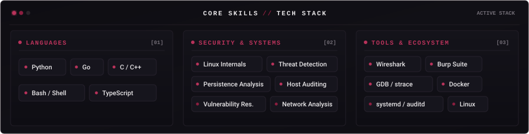

<!-- System Status Stream -->

 

  <b>Security researcher &amp; software engineer</b> focused on <b>Linux systems</b>, <b>threat detection</b>, and <b>practical security tooling</b>. 
  Exploring how systems break, building tools to defend them, and keeping software reliable.

 

### Skills &amp; Technologies

  Comfortable with systems programming, automation, host security auditing, and cloud environments.

 

### Activity &amp; Language Metrics

<table>
  <tr>
    <td width="50%" align="center" valign="middle">
      
    </td>
    <td width="50%" align="center" valign="middle">
      
    </td>
  </tr>
  <tr>
    <td width="58%" align="center" valign="middle">
      
    </td>
    <td width="42%" align="center" valign="middle">
      
    </td>
  </tr>
</table>

 

  
  &nbsp;
  

<!-- Profile view tracking -->

